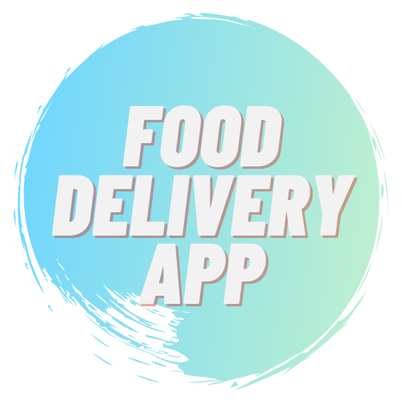

<!--
*** Thanks for checking out the Best-README-Template. If you have a suggestion
*** that would make this better, please fork the repo and create a pull request
*** or simply open an issue with the tag "enhancement".
*** Thanks again! Now go create something AMAZING! :D
-->

<!-- PROJECT SHIELDS -->
<!--
*** I'm using markdown "reference style" links for readability.
*** Reference links are enclosed in brackets [ ] instead of parentheses ( ).
*** See the bottom of this document for the declaration of the reference variables
*** for contributors-url, forks-url, etc. This is an optional, concise syntax you may use.
*** https://www.markdownguide.org/basic-syntax/#reference-style-links
-->

[![LinkedIn][linkedin-shield]][linkedin-url]

<!-- PROJECT LOGO -->
<br />
<p align="center">

  <a href="https://github.com/joshuasamaniego/food-delivery-app">
    
  </a>

  <h3 align="center">Food-Delivery-App</h3>

  <p align="center">
    Like this ReadMe template? Click below!
    <br />
    <a href="https://github.com/othneildrew/Best-README-Template"><strong>Explore the ReadMe template docs »</strong></a>
    <br />
  </p>
</p>

<!-- TABLE OF CONTENTS -->
<details open="open">
  <summary>Table of Contents</summary>
  <ol>
    <li>
      <a href="#about-the-project">About The Project</a>
      <ul>
        <li><a href="#built-with">Built With</a></li>
      </ul>
    </li>
    <li>
      <a href="#getting-started">Getting Started</a>
      <ul>
        <li><a href="#installation">Installation</a></li>
      </ul>
    </li>
    <li><a href="#license">License</a></li>
    <li><a href="#contact">Contact</a></li>
    <li><a href="#acknowledgements">Acknowledgements</a></li>
  </ol>
</details>

<!-- ABOUT THE PROJECT -->

## About The Project

[![Product Name Screen Shot][product-screenshot]](food-delivery/public/assets/food-delivery-app-welcome-page.png)

This is a 2-week app done through Clever Programmer's Full Stack Mastery Bootcamp. This particular project had the following requirements in order to meet MVP:

- The project needed to be 3 pages.
- It must utilize 2 APIs (Google Maps + 1 more).
- It needs a form to interact with users.
- It needs to use Redux ToolKit as a state management system.
- For the Backend, it needs to use Firebase (Auth and Hosting) and Firestore.

We were allowed to put our own design spin on the project, so I decided to use neumorphic design throughout.

### Built With

Frontend:

- [Reactjs](https://reactjs.org/)
- [Styled Components](https://styled-components.com/docs/basics)
- [Google Maps React](https://www.npmjs.com/package/google-maps-react)

Backend:

- [Firebase](https://firebase.google.com/)
- [Redux Toolkit](https://redux-toolkit.js.org/)

Apis:

- [Google Maps API](https://developers.google.com/maps)
- [Google Maps Geolocation API](https://developers.google.com/maps/documentation/geolocation/overview)
- [Documenu API](https://documenu.com/)

<!-- GETTING STARTED -->

## Getting Started

### Installation

1. Get a Google API Key at [https://developers.google.com/maps/documentation/places/web-service/get-api-key](https://developers.google.com/maps/documentation/places/web-service/get-api-key)
2. Clone the repo
   ```sh
   git clone https://github.com/joshuasamaniego/food-delivery-app
   ```
3. Install NPM packages
   ```sh
   npm install
   ```
4. Save your API key in a .env file
5. And finally:
   ```sh
   npm start
   ```

<!-- LICENSE -->

## License

Distributed under the MIT License.

<!-- CONTACT -->

## Contact

Joshua Samaniego - [@joshdavsam](https://twitter.com/joshdavsam/) - joshuadsamaniego@gmail.com

Project Link: [https://github.com/joshuasamaniego/food-delivery-app](https://github.com/joshuasamaniego/food-delivery-app/)

<!-- ACKNOWLEDGEMENTS -->

## Acknowledgements

Design Priciples:

- [Neumorphic Design Generator](https://neumorphism.io/#ddd736/)
- [Article on Neumorphic Design](https://uxdesign.cc/neumorphism-in-user-interfaces-b47cef3bf3a6/)

Color Scheme:
[![Color Scheme Screen Shot][color-scheme-screenshot]](food-delivery/public/assets/fda-color-scheme.png)

Fonts:

- [Barlow Condensed](https://fonts.google.com/specimen/Barlow+Condensed)

Food-Delivery-App Logo:

- [Canva](https://www.canva.com/)

Clever Programmer:

- [YouTube Channel](https://www.youtube.com/channel/UCqrILQNl5Ed9Dz6CGMyvMTQ)
- [Full Stack Mastery Bootcamp](https://www.cleverprogrammer.com/full-stack-mastery-coding-bootcamp/)

<!-- MARKDOWN LINKS & IMAGES -->
<!-- https://www.markdownguide.org/basic-syntax/#reference-style-links -->

[linkedin-shield]: https://img.shields.io/badge/-LinkedIn-black.svg?style=for-the-badge&logo=linkedin&colorB=555
[linkedin-url]: https://www.linkedin.com/in/joshua-samaniego/
[product-screenshot]: food-delivery/public/assets/food-delivery-app-welcome-page.png
[color-scheme-screenshot]: food-delivery/public/assets/fda-color-scheme.png
